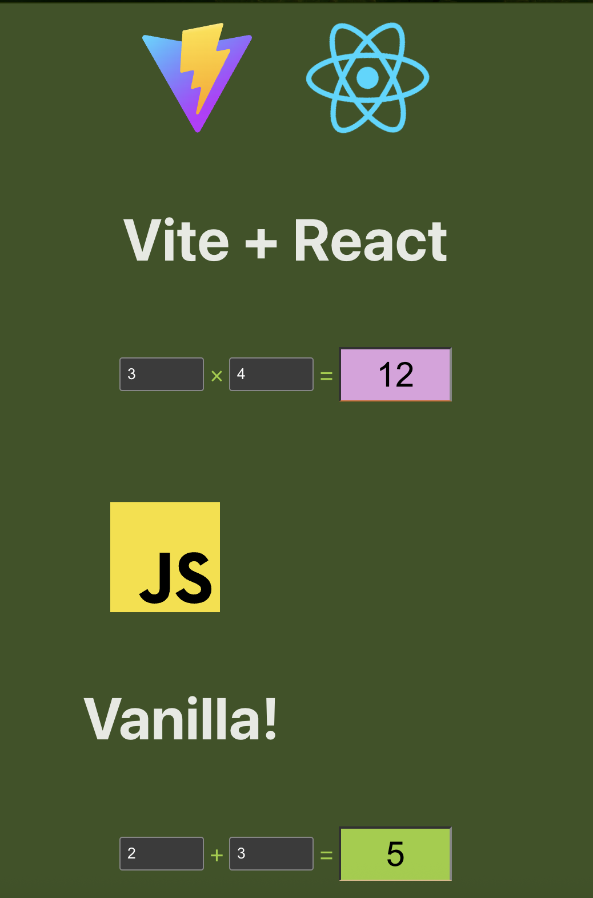
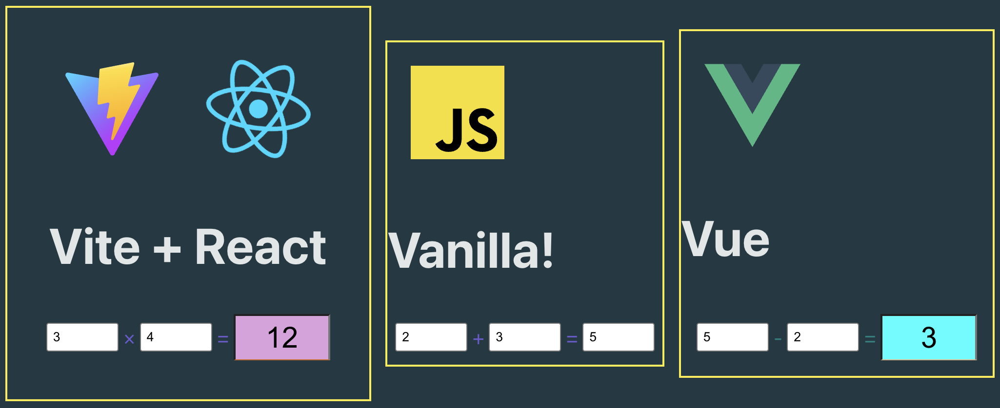
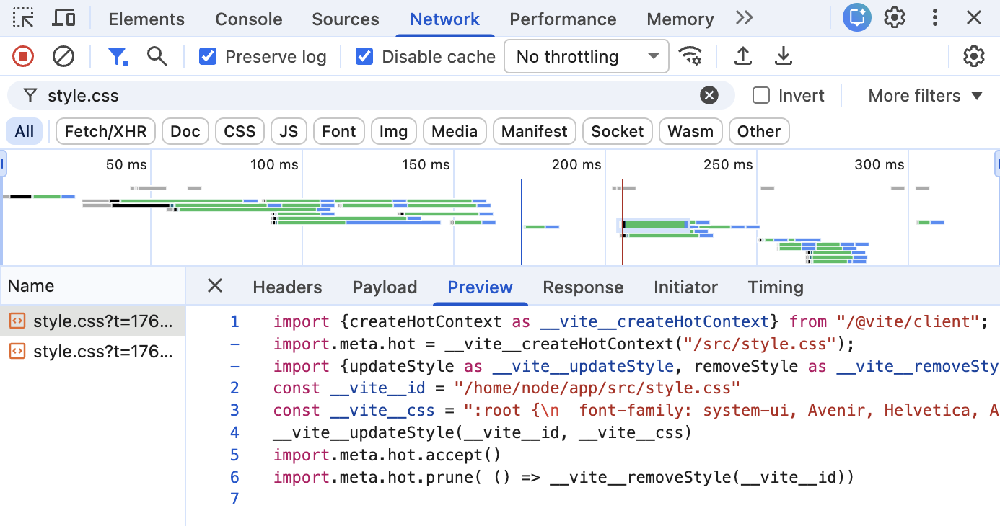

# Module Federation Implementation Notes

## Vanilla JS Federated App Integration



### Critical Issues Identified

#### 1. Event Lifecycle Management
- **Problem**: `window.onload` events don't fire for dynamically loaded federated modules.
- **Root Cause**: The main page (host) has already completed loading when the federated module is imported.
- **Impact**: Initialization code executes immediately instead of waiting for DOM readiness.
- **Reference**: [Commit cd2471c](https://github.com/darioriverat/module-federation/commit/cd2471c239aaed18abc77558803e1c1e8f2c4455)

#### 2. CSS Cascading Conflicts
- **Problem**: Style conflicts between host and federated applications.
- **Example**: `.operator` class styling is overridden by the last loaded module (app_one).
- **Impact**: Visual inconsistencies and unintended styling inheritance.
- **Solution Considerations**:
  - CSS-in-JS or scoped styles
  - CSS modules with unique class names
  - Shadow DOM implementation

#### 3. CSS Selector Context Issues
- **Problem**: CSS styles targeting `#app` don't apply when the federated module is mounted to `#app_one`.
- **Root Cause**: Federated application CSS selectors are designed for `#app` container but fail when mounted to different container IDs like `#app_one`.
- **Impact**: Layout breakage, positioning issues, and visual inconsistencies in federated context.
- **Example**: Header and image centering styles fail because they rely on `#app` selector which doesn't exist in the federated mounting context.

## Vue.js Federated App Integration



### Framework-Specific Observations

#### Vue.js Integration
- **Scoped Styles**: Vue's scoped CSS works correctly and doesn't leak to other federated applications
- **Global Styles**: Global styles (like background colors) still propagate across all federated modules
- **Isolation**: Framework-level CSS scoping provides better isolation than vanilla JavaScript approaches

### Development Environment Issues

#### HMR Style Collision


- **Problem**: Vite HMR assigns identical identifiers to `style.css` files from different federated modules
- **Example**: Both app_one and app_two receive the same identifier: `const __vite__id = "/home/node/app/src/style.css"`
- **Impact**: HMR completely removes styles from one application and replaces them with another's styles
- **Behavior**: 
  - Last loaded module's styles take precedence
  - Modifying styles in the "losing" module temporarily restores its styles but removes the other's
- **Scope**: Only occurs in development mode with HMR enabled
- **Workaround**: Unique file naming or paths for federated apps.

## Production Environment Issues

### 1. Module Export Structure Differences
- **Problem**: Module federation wraps exports differently in production vs development
- **Development**: Direct import from source files (`/src/main.js`) - exports available directly
- **Production**: Import from federated modules (`remote_one/main`) - exports may be wrapped
- **Example**:
  ```javascript
  // Development works:
  remote_one_module.mountComponent({elementId: '#app_one'})
  
  // Production requires:
  remote_one_module.default.mountComponent({elementId: '#app_one'})
  ```
- **Solution**: Handle both cases dynamically:
  ```javascript
  const remote_one = remote_one_module.default || remote_one_module;
  remote_one.mountComponent({elementId: '#app_one'})
  ```

### 2. Static Asset Path Resolution
- **Problem**: Images and static assets fail to load in federated modules during production
- **Root Cause**: Asset paths are resolved relative to the federated module's build location, not the host application
- **Impact**: Broken images, missing icons, and 404 errors for static resources
- **Examples**:
  - `/javascript.svg` becomes unreachable when app is federated
  - CSS background images fail to load
  - Public folder assets return 404 errors
- **Development vs Production Behavior**:
  - **Development**: Vite automatically converts small images to base64 format, embedding them directly in the bundle - no external requests needed
  - **Production**: Images remain as separate files requiring proper base path configuration for correct URL resolution
- **Solution**: Configure Vite base URL using environment variables:
  ```javascript
  // In vite.config.js
  export default defineConfig(({ mode }) => {
    const env = loadEnv(mode, process.cwd())
    const basePath = env.VITE_PUBLIC_BASE_PATH || '/'

    return {
      base: basePath,
      // ... rest of config
    }
  })
  ```
  ```bash
  # In .env.production
  VITE_PUBLIC_BASE_PATH=http://localhost:5281/
  ```
- **Reference**: [Commit f7c51e9](https://github.com/darioriverat/module-federation/commit/f7c51e9)

### 3. CORS Configuration Required
- **Problem**: Cross-origin requests blocked when loading federated modules in production
- **Error**: `Access to script at 'http://localhost:5281/assets/one.js' from origin 'http://localhost:5280' blocked by CORS`
- **Root Cause**: Static file servers (like `serve`) don't include CORS headers by default
- **Solution**: Add `--cors` flag to serve command:
  ```bash
  serve -s dist -l 5281 --cors
  ```

### 4. Dynamic Import Warnings
- **Issue**: Vite shows warnings about dynamic imports that cannot be analyzed
- **Warning**: `This dynamic import cannot be analyzed by Vite`
- **Solution**: Use `/* @vite-ignore */` comment to suppress warnings:
  ```javascript
  import(/* @vite-ignore */ `${remote_url}/src/main.js`)
  ```
- **Note**: This is expected behavior for module federation dynamic imports
